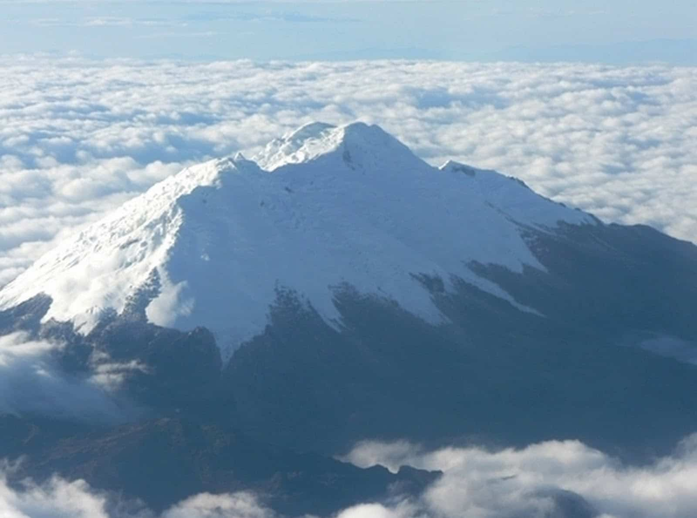

```{r setup, include=FALSE}
knitr::opts_chunk$set(echo=F)
```
```{r}
suppressPackageStartupMessages(library(leaflet))
```


## Nevado del Huila National Natural Park, Colombia.

```{r pressure, fig.cap="Snowy top"}

```

The Nevado del Huila is an active stratovolcano located in the Central Cordillera of Colombia. Its summit reaches 5,364 meters above sea level, being the fourth highest mountain in the country after the twin peaks of the Sierra Nevada de Santa Marta and Ritacuba Blanco located in the Sierra Nevada del Cocuy. The snowy mountain, which is the central point of the Nevado del Huila National Natural Park, is divided territorially between the departments of Huila, Tolima and Cauca, with its peak being the highest point of the three. It has an ice cap of more than 13 km².

```{r, }
my_map <- leaflet() %>%
     addTiles() %>%
     addMarkers(lat=2.92581944, lng=-76.02881389, 
             popup="Nevado del Huila") %>%
     addRectangles(lat1 = 2.611614, lng1 = -76.377539, 
                lat2 = 3.218911, lng2 = -75.584731)
my_map
```

